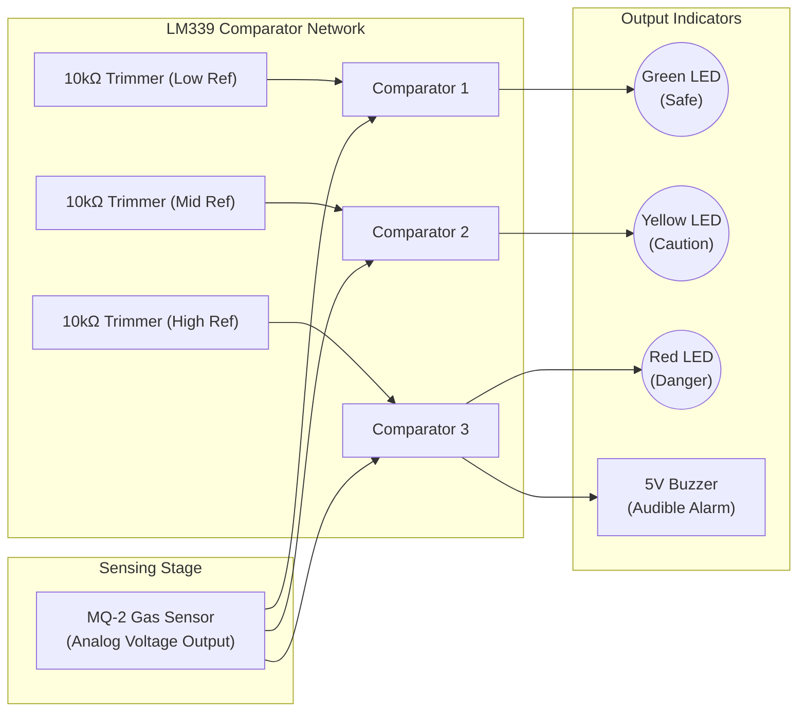

# Cost-Efficient Multi-Threshold Gas Leakage Detector

[]()
[]()
[]()
[](Gas_Detector_Report.pdf)
[](LICENSE)

A bare-boned, cost-efficient hardware architecture for detecting combustible gases (LPG, methane, hydrogen, and volatile organic vapors)[cite: 21]. This proof-of-concept project utilizes an **MQ-2 metal-oxide semiconductor (MOS) sensor** and an **LM339 quad comparator** network to establish tunable, multi-threshold alerts without requiring a microcontroller or complex programming[cite: 21]. 

Targeted at resource-constrained environments, this system is ideal for residential kitchens, laboratories, automotive compartments, and light industrial safety applications[cite: 21].

---

> ### ⚠️ Project Context & Calibration Disclaimer
> * **Qualitative Testing**: This system has undergone qualitative response testing to verify correct state transitions during various levels of gas exposure[cite: 21]. 
> * **Calibration Notice**: The prototype has **not been quantitatively calibrated** against standard reference gas mixtures[cite: 21]. 
> * **Environmental Factors**: MOS sensors are subject to cross-sensitivity, humidity, and temperature drift. Periodic functional checks and protective enclosures are required for robust real-world deployment[cite: 21].

---

## System Architecture & Operating Principle

The system operates entirely on analog voltage comparisons. The MQ-2 sensor outputs an analog signal proportional to the ambient gas concentration[cite: 21]. This signal is fed into the LM339 quad comparator IC. A resistor divider network, utilizing $10\text{k}\Omega$ trimmer potentiometers, sets distinct reference voltages (thresholds) for each comparator[cite: 21].



When the sensor voltage crosses a specific trimmer's reference voltage, the respective comparator triggers[cite: 21]:
* **Safe Level**: Green LED illuminates[cite: 21].
* **Caution Level**: Yellow LED illuminates[cite: 21].
* **Danger Level**: Red LED illuminates and the 5V active buzzer sounds[cite: 21].

---

## Bill of Materials (BOM) & Cost Analysis

The prototype achieves a significantly lower cost compared to commercial detectors (which typically cost ~2000 BDT) while supporting a wider range of target gases[cite: 21].

| Component | Quantity | Estimated Cost (BDT) |
| :--- | :--- | :--- |
| **MQ-2 Gas Sensor**[cite: 21] | 1[cite: 21] | 210[cite: 21] |
| **LM339 Quad Comparator**[cite: 21] | 1[cite: 21] | 5[cite: 21] |
| **10kΩ Trimmer Potentiometer**[cite: 21] | 3[cite: 21] | 20[cite: 21] |
| **220Ω Resistor**[cite: 21] | 3[cite: 21] | 5[cite: 21] |
| **470kΩ Resistor**[cite: 21] | 1[cite: 21] | 10[cite: 21] |
| **Buzzer (5 V)**[cite: 21] | 1[cite: 21] | 5[cite: 21] |
| **5 V Power Supply**[cite: 21] | 1[cite: 21] | 50[cite: 21] |
| **LEDs (Red, Yellow, Green)**[cite: 21] | 3[cite: 21] | 3[cite: 21] |
| **Breadboard**[cite: 21] | 2[cite: 21] | 150[cite: 21] |
| **Misc. Wires / Jumpers**[cite: 21] | -[cite: 21] | 110[cite: 21] |
| **Total Estimated Cost**[cite: 21] | | **564 BDT**[cite: 21] |

---

## Future Roadmap

While this bare-bones architecture provides immediate localized safety alerts, future iterations can extend this framework by[cite: 21]:
1. **Calibration**: Quantitative calibration against standardized gas mixtures[cite: 21].
2. **Hysteresis**: Adding feedback resistors to the LM339 comparators to introduce hysteresis and reduce false-triggering/flickering at threshold boundaries[cite: 21].
3. **IoT Integration**: Tapping the comparator outputs into an ESP32 or ESP8266 node for remote telemetry and cloud alerts[cite: 21].
4. **Compliance**: Designing a rugged enclosure to meet IEC 60079-29 standards for explosive atmosphere detectors[cite: 21].

---

## Repository Structure

```text
analog-gas-leakage-detector/
├── .gitignore
├── LICENSE
├── README.md
└── Gas_Detector_Report.pdf
```

---

## Citation

If you reference this hardware architecture or cost analysis, please refer to the project report:

```bibtex
@misc{gas_detector_2026,
  title={A Cost-Efficient Multi-Threshold Gas Leakage Detector Using an MQ-2 Sensor and LM339 Comparators},
  author={[Your Name / Project Team]},
  year={2026},
  note={Hardware Prototype Documentation}
}
```
